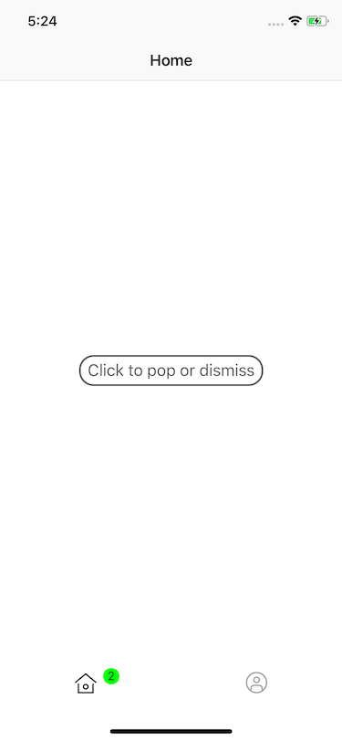
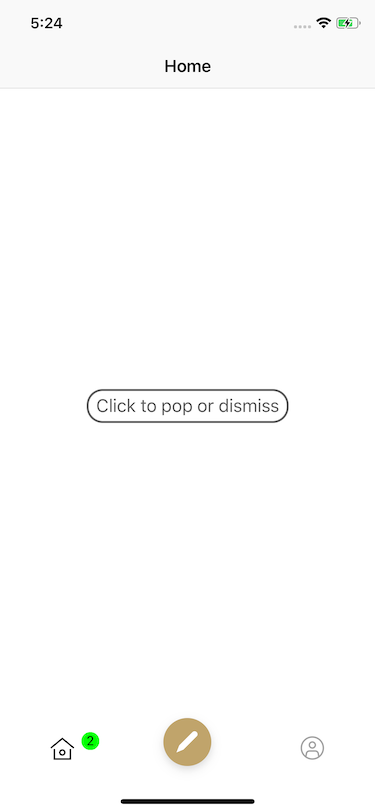

# Tabbar

<!-- TOC -->

- [Tabbar](#tabbar)
    - [概述](#概述)
    - [UITabBarController](#uitabbarcontroller)
    - [关于 self.title](#关于-selftitle)
    - [UITabBar](#uitabbar)
    - [UITabBarItem](#uitabbaritem)
    - [仿闲鱼自定义 TabBar](#仿闲鱼自定义-tabbar)

<!-- /TOC -->

## 概述

本文主要基于 UITabBarController/UITabBar 讲述一些常用的接口用法，在此基础上会实现一些常见的自定义 UI 。本文的代码示例 [地址](https://github.com/alflix/awesome-ios/tree/master/Awesome/Awesome/App/Tabbar)

## UITabBarController

UITabBarController，和 [UINavigationController](https://github.com/alflix/awesome-ios/blob/master/UIKit/UINavigation/UINavigation.md#%E6%A6%82%E8%BF%B0) 一样是容器类（Container），利用集合的方式对 ViewController 进行管理。大部分情况下，UITabBarController 都会作为 app 的 rootViewController：

```swift
@UIApplicationMain
class AppDelegate: UIResponder, UIApplicationDelegate {
    var window: UIWindow?
    func application(_ application: UIApplication, didFinishLaunchingWithOptions launchOptions: [UIApplication.LaunchOptionsKey: Any]?) -> Bool {
        window = UIWindow(frame: UIScreen.main.bounds)
        guard let keyWindow = window else { return false }
        keyWindow.backgroundColor = .white
        keyWindow.rootViewController = TabBarController()
        keyWindow.makeKeyAndVisible()
    }
}
```

作为容器类，UITabBarController 通常都是配合 UINavigationController 一起使用，因此存在两种比较常见的层级处理方式:

第一种：

```swift
├── UINavigationController
└──── UITabBarController
└────── UIViewController
└──────── SubviewControllers
```

即 rootViewController 的实现改为：

```swift
keyWindow.rootViewController = UINavigationController(rootViewController: TabBarController())
```

第二种则是：

```swift
├── UITabBarController
└──── UINavigationController
└────── UIViewController
└──────── SubviewControllers
```

有两个地方需要注意，第一种情况，UINavigationBar 的 title 将由 UITabBarController 管理，对 UIViewController 设置 self.title 将不起作用。

而第二种情况在 viewController push 子视图的时候需要设置 hidesBottomBarWhenPushed = true, 第一种则不需要。

个人倾向于使用第二种方式。

基于容器类的思想，UITabBarController 通过 ViewController 的拓展添加了 tabBarController，使其暴露出 tabBarController 属性交由 ViewController 管理。

```swift
extension UIViewController {
    open var tabBarController: UITabBarController? { get }
}
```

## 关于 self.title

设置一个 ViewController 的标题时，我们通常这样：

```swift
title = "title"
```

或：

```swift
navigationItem.title = "title"
```

然而，这两种方式有什么区别？为什么有时候不设置 tabBarItem.title，tabBarItem 也会显示一个 title 呢？

关于在一个 ViewController 中设置相关标题简单总结如下：

- self.navigationItem.title: 设置 ViewController 顶部导航栏的标题

- self.tabBarItem.title: 设置 ViewController 底部标签栏的标题

- self.title: 同时修改上述两处的标题

## UITabBar

UITabBar，是 UITabBarController 底部的显示区域，主要负责 UI 的展示。UITabBar 有以下常见的设置：

```swift
func setupUI() {
    // 背景颜色, 会覆盖掉 barStyle 属性
    tabBar.barTintColor = .white
    // 控件选中状态下的着色
    tabBar.tintColor = .black
    // 是否毛玻璃效果
    tabBar.isTranslucent = true
    // 拓展方法：移除顶部的分割线
    tabBar.removeShadowLine()
    // 拓展方法：设置未选中状态的控件颜色
    tabBar.unselectedTintColor = .gray
}
```

其中 unselectedTintColor 是拓展的属性，因为 unselectedItemTintColor 只支持 iOS10 以上，所以可以利用 runtime 的方法为 tabbar 添加拓展的新属性。( associatedObject 方法见[此处](https://github.com/alflix/awesome-ios/blob/master/UIKit/UINavigation/Navigation.md#%E6%96%B9%E6%A1%882))

removeShadowLine 的实现和 [navigationBar 移除分割线](https://github.com/alflix/awesome-ios/blob/master/UIKit/UINavigation/Navigation.md#%E5%88%86%E5%89%B2%E7%BA%BF)类似。

```swift
extension UITabBar {
    fileprivate struct AssociatedKey {
        static var unselectedTintColor: UInt8 = 0
    }

    /// 未选中状态的控件颜色
    open var unselectedTintColor: UIColor? {
        get {
            if #available(iOS 10.0, *) {
                return unselectedItemTintColor
            }
            return associatedObject(base: self, key: &AssociatedKey.unselectedTintColor) { return tintColor }
        }
        set {
            if #available(iOS 10.0, *) {
                unselectedItemTintColor = unselectedTintColor
            }
            associateObject(base: self, key: &AssociatedKey.unselectedTintColor, value: newValue)
        }
    }

    /// 移除顶部的分割线
    open func removeShadowLine() {
        backgroundImage = UIImage()
        shadowImage = UIImage()
    }
}
```

其他一些不常见的设置：

```swift
func setupAdditionUI() {
    // 样式，在没有设置 barTintColor 的时候起作用，比较少用
    tabBar.barStyle = .black
    // 背景图片，注意图片是平铺的，需要处理好图片再进行设置或设置 clipsToBounds = true（会覆盖掉 barStyle,isTranslucent 属性）
    tabBar.backgroundImage = UIImage(named: "trello")
    // item 选中之后会额外显示的图片，很奇怪的接口，一般不用
    tabBar.selectionIndicatorImage = UIImage(named: "icon_back")
    // item 的布局方式，一般默认即可
    tabBar.itemPositioning = .centered
    // item 的宽度（itemPositioning = .centered 时有效）
    tabBar.itemWidth = 44
    // item 的间距（itemPositioning = .centered 时有效）
    tabBar.itemSpacing = 88
}
```

## UITabBarItem

UITabBar 包含 UITabBarItem ，同样通过 ViewController 的拓展添加了 tabBarItem。

```swift
open class UINavigationController : UIViewController {
    open var tabBarItem: UITabBarItem!
}
```

UITabBarItem 是一个抽象类，继承至 UIBarItem-NSObject，可以设置 title，image，selectedImage 等元素。通常配置这些元素都是在设置子控制器的过程中。所以我们可以通过一个方法来封装这个过程：

```swift
public extension UITabBarController {
    /// 1.添加子控制器
    ///
    /// - Parameters:
    ///   - controller: 子控制器
    ///   - imageName: 图标, 选中/未选中图标根据 tintColor/unselectedTintColor 而定
    ///   - title: 文字
    public func add(child controller: UIViewController, imageName: String, title: String? = nil) {
        add(child: controller, imageName: imageName, selectImageName: nil,
            title: title, navigationClass: UINavigationController.self)
    }

    /// 2.添加子控制器
    ///
    /// - Parameters:
    ///   - controller: 子控制器
    ///   - imageName: 图标
    ///   - selectImageName: 选中的图标
    ///     - 不为空时，imageName 对应未选中的图标，selectImageName 对应选中的图标
    ///     - 为空时，选中/未选中图标根据 imageName 以及 tintColor/unselectedTintColor 而定
    ///   - title: 文字
    ///   - name: 可传入继承自 UINavigationController 的 class
    ///   - handler: 暴露出 UITabBarItem，可以设置额外的属性
    public func add<T: UINavigationController>(child controller: UIViewController,
                                               imageName: String,
                                               selectImageName: String? = nil,
                                               title: String? = nil,
                                               navigationClass name: T.Type,
                                               tabBarItemUpdate: ((UITabBarItem) -> Void)? = nil) {
        guard let image = UIImage(named: imageName) else {
            fatalError("cant find image by imageName!")
        }
        let tabBarItem = UITabBarItem(title: title)
        if let selectImageName = selectImageName {
            guard let selectedImage = UIImage(named: selectImageName) else {
                fatalError("cant find image by selectImageName!")
            }
            // 显示原图
            tabBarItem.image = image.withRenderingMode(.alwaysOriginal)
            tabBarItem.selectedImage = selectedImage.withRenderingMode(.alwaysOriginal)
        } else {
            if #available(iOS 10.0, *) {
                tabBarItem.image = image
            } else {
                let unselectedTintColor: UIColor! = tabBar.unselectedTintColor ?? tabBar.tintColor
                // 未选中状态下的图片
                let unselectImage = image.tint(unselectedTintColor, blendMode: .destinationIn)
                tabBarItem.image = unselectImage
                // 选中状态下的图片
                let selectImage = image.withRenderingMode(.alwaysTemplate)
                tabBarItem.selectedImage = selectImage

                // 未选中状态下的文字属性, 这个属性会使得 self.tabBar.tintColor 对文字的设置不再生效，所以需要重新设置选中状态下的文字属性
                let textAttrs: [NSAttributedString.Key: Any] = [.foregroundColor: unselectedTintColor]
                tabBarItem.setTitleTextAttributes(textAttrs, for: .normal)
                // 选中状态下的文字属性
                let selectedTextAttrs: [NSAttributedString.Key: Any] = [.foregroundColor: tabBar.tintColor]
                tabBarItem.setTitleTextAttributes(selectedTextAttrs, for: .selected)
            }
        }
        controller.tabBarItem = tabBarItem
        tabBarItemUpdate?(tabBarItem)
        let navigationController = T(rootViewController: controller)
        addChild(navigationController)
    }
}
```

基本思想是我们需要定义一个基本的设置方法（1.添加子控制器），其中只需要传入子控制器、tabbar显示的图片、文字，这个方法帮我们处理好选中/未选中图片、文字的颜色问题（iOS 10 以下需要手动设置所有属性）。

同时，定义一个支持更多属性的方法（2.添加子控制器），包括支持继承 UINavigationController 的类传入（利用范型），通过 block 支持 UITabBarItem 的额外设置。

如下，可以这么调用：

```swift
private func addChilds() {
    // 通过封装好的方法设置 title，image，selectedImage 等元素（此处只是示例调用）
    add(child: ExampleViewController(title: "Home"), imageName: "icon_home", navigationClass: NavigationController.self) { (item) in
        // 支持设置 UITabBarItem 的其他属性
        // 文字位置调整
        item.titlePositionAdjustment = UIOffset(horizontal: 0, vertical: 0)
        // 角标背景颜色，文字颜色调整，只支持 iOS 10.0 以上
        if #available(iOS 10.0, *) {
            item.badgeColor = .green
            item.setBadgeTextAttributes([.foregroundColor: UIColor.black], for: .normal)
        }
        // 角标显示的文字
        item.badgeValue = "2"
    }
    add(child: ExampleViewController(title: "Me"), imageName: "icon_me")
}
```

第一个方法演示了其他属性的设置，titlePositionAdjustment，badgeColor，badgeValue 等。

结果如下：



## 仿闲鱼自定义 TabBar

闲鱼 TabBar 的样式，一个重要的特征就是中间有个凸起的 Item。

为了达到这个效果，需要利用 KVC，设置一个继承自 UITabBar 的类，如下：

```swift
setValue(customTabBar, forKeyPath: "tabBar")
```

customTabBar，我们定义一个命名为 BulgeTabBar 的类，如下：

```swift
import UIKit
import ActionKit

class BulgeTabBar: UITabBar {
    /// 往上移动的偏移量
    var offsetY: CGFloat = 0
    private var bulgeIndexs: [Int] = []
    private var indexToButton: [Int: UIButton] = [:]

    override init(frame: CGRect) {
        super.init(frame: frame)
    }

    required init?(coder aDecoder: NSCoder) {
        fatalError("init(coder:) has not been implemented")
    }

    override func setItems(_ items: [UITabBarItem]?, animated: Bool) {
        super.setItems(items, animated: animated)
        var tabBarButtonIndex = -1
        for subview in subviews where NSStringFromClass(type(of: subview)) == "UITabBarButton" {
            tabBarButtonIndex += 1
            if bulgeIndexs.contains(tabBarButtonIndex) {
                if let button = indexToButton[tabBarButtonIndex] {
                    button.frame = subview.frame
                    button.frame.origin.y -= offsetY
                    addSubview(button)
                }
            }
        }
        layoutSubviews()
    }

    /// - Parameters:
    ///   - index: 凸起 item 的位置
    ///   - tabBarItem: 支持 image，selectedImage（实际是用于 highlighted）的设置
    ///   - closure: 点击回调
    func addBulgeIndexs(index: Int, tabBarItem: UITabBarItem, _ closure: VoidBlock?) {
        /// 之所以用 Button，而不是调整原先的 UITabBarButton，是因为 highlighted 状态的显示
        let button = UIButton()
        button.setImage(tabBarItem.image, for: .normal)
        button.setImage(tabBarItem.selectedImage, for: .highlighted)
        button.imageView?.contentMode = .scaleAspectFill
        button.imageView?.clipsToBounds = false
        button.addControlEvent(.touchUpInside) {
            closure?()
        }
        indexToButton[index] = button
        bulgeIndexs.append(index)
    }
}

```

其中核心是这个方法：

```swift
func addBulgeIndexs(index: Int, tabBarItem: UITabBarItem, _ closure: VoidBlock?)
```

index，即这个凸起 item 的位置，方便自定义位置，而不是仅仅支持中间凸起。为了支持这个特性，我们需要用一个 [Int: UIButton] 将其关联起来。

tabBarItem，这里利用 UITabBarItem 的属性来设置这个凸起的 item，不管它具体的实现是什么，符合 UITabBar 的正常用法。

closure，即把点击事件暴露出来，满足点击这个 item 之后的进一步动作。

然后，我们重载 func setItems(_ items: [UITabBarItem]?, animated: Bool) 这个方法，这个方法中，我们找到原先的 UITabBarButton 的位置，然后赋值给新的 UIButton，设置 button.frame.origin.y -= offsetY(offsetY 是我们开放的属性)，最后 addSubview(button)，这样就完成了整个操作。（思考下为什么不调整原来的 UITabBarButton 即可？）

最后一个容易漏掉的问题，即这个 凸起 item 超出了点击区域，超出部分是无法响应点击区域的，所以需要加上：

```swift
// 处理超出区域点击无效的问题
override func hitTest(_ point: CGPoint, with event: UIEvent?) -> UIView? {
    if !self.isHidden {
        for subview in subviews where NSStringFromClass(type(of: subview)) == "UIButton" {
            let tempPoint = subview.convert(point, from: self)
            if subview.bounds.contains(tempPoint) {
                return subview
            }
        }
    }
    return super.hitTest(point, with: event)
}
```

结果如下：


